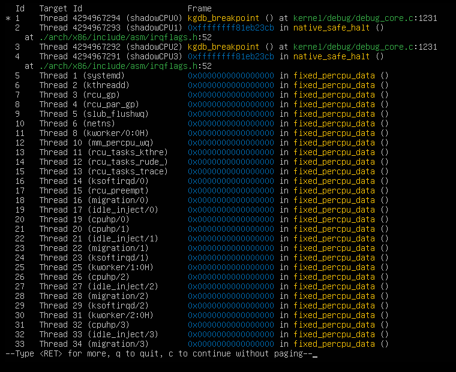

## 内核调试

‍内核模块与内核是协同配合工作的，在一些复杂的内核环境下使用printk调试内核模块来解决问题变得非常困难。为了弥补在qemu虚拟机中无法模拟复杂内核环境找出问题的缺点，远程调试Linux内核变得尤为重要。

### 被调试端

使用kgdb需要的内核配置在较新的发行版（ubuntu22.10）中都已被默认开启。不用再费心配置，但可以点击下面网址了解以下：[https://blog.csdn.net/weixin_39829501/article/details/111040553#t1](https://blog.csdn.net/weixin_39829501/article/details/111040553#t1)

如果要调试修改过的内核，使用以下命令重新编译安装内核

```bash
sudo apt install linux-source
cd /usr/src/
sudo tar -xf linux-source.tar.bz2
cd linux-source-*/
sudo make olddefconfig
sudo make localmodconfig
sudo make
sudo make modules_install
sudo make install
sudo update-grub
```

> 如果你只是为了学习一下Linux，而不是自己修改了一些文件必须重新编译内核，你也可以选择下载别人的编译结果，这非常方便。参考这篇[Ubuntu Wiki](https://link.zhihu.com/?target=https%3A//wiki.ubuntu.com/Debug%2520Symbol%2520Packages%23Getting_-dbgsym.ddeb_packages)。
>
> 首先，我们通过下面的命令创建`/etc/apt/sources.list.d/ddebs.list`​，更新列表。
>
> ```text
>  echo "deb http://ddebs.ubuntu.com $(lsb_release -cs) main restricted universe multiverse
>  deb http://ddebs.ubuntu.com $(lsb_release -cs)-updates main restricted universe multiverse
>  deb http://ddebs.ubuntu.com $(lsb_release -cs)-proposed main restricted universe multiverse" | \
>  sudo tee -a /etc/apt/sources.list.d/ddebs.list
>  sudo apt install ubuntu-dbgsym-keyring
>  sudo apt-get update
> ```
>
> 然后可以下载带有调试信息的image。
>
> ```text
>  sudo apt-get install linux-image-`uname -r`-dbgsym
> ```
>
> vmlinux在`/usr/lib/debug/boot/vmlinux-`uname -r``​，把他拿出来就可以调试了。
>
> [Linux内核调试环境搭建 - 知乎 (zhihu.com)](https://zhuanlan.zhihu.com/p/509070813)

设置开机选项，编辑 `/etc/default/grub`​ 在系统启动参数里加入 `kgdboc=ttyS1,115200 nokalsr`​，主要是为了关闭nokaslr（内核地址随机化）方便调试，kgdboc选项可以开机后设置。

使用以下命令将符号信息传输到调试端：

```bash
scp <your kernel code dir> <your module code dir> <user name>@<debugger ip address>:<a path>
```

之后需要输入调试端用户密码，便传输成功了，感觉在不需要实时同步的场景下比共享文件夹好用。

关闭被调试端，在vm设置中添加串行端口并使用下图中的设置：


开机，配置串行端口（`com_1`​一般对应`ttyS0`​）

```bash
# root用户
echo ttyS0,115200 > /sys/module/kgdboc/parameter/kgdboc
```

进入假死被调试模式

```bash
# root
echo g > /proc/sysrq-trigger
```

### 调试端

关机后同样添加一个串口并如下配置：


开机，调试端的编译过的Linux内核源代码目录、内核模块目录确保拷贝到了调试端，然后执行如下命令

```bash
# root用户
stty -F /dev/ttyS0 115200 # 修改设备波特率
gdb vmlinux # Linux内核源代码目录中
(gdb) set detach-on-fork on # 不跟踪子进程
(gdb) target remote /dev/ttyS0 # 连接被调试端
(gdb) set scheduler-locking step # 当命中时跳到命中线程，并停止全部线程
```

### 效果图

注：vscode连接了调试端，vm当前窗口显示被调试端。


在gdb中使用`info threads`​查看所有线程的信息：



其中括号中为线程名，前几个名称以`shadowCPU`开头的线程表示在每个CPU上的线程，可见在当前被调试端锁定时只有挂起函数在运行。之后的线程即为被调试端上的所有真实线程。可以使用`thread <thread id>`命令设置断点线程。

## 模块段地址信息

使用`cat /proc/modules | grep <module_name>`​来查看内核模块在内存中的起始位置：


依照上述结果，使用以下命令在gdb中添加模块的符号信息：

```c
add-symbol-file <module_file_path> 0xffffffffa06a90a0
```
## 添加硬断点

因为调试端添加软件断点`breakpoint`只是在本地内存进行添加，无法添加到被调试端的内存中，所以这里需要使用硬断点`hbreak`，将断点地址存入被调试端的断点寄存器中，即可使被调试端在运行到相应地址时挂起，使调试端的gdb获得干预的机会。但是因为断点寄存器的数量较少，最多只能设置硬件寄存器数量的硬件断点。

使用方法和`breakpoint`一致，在`hbreak`后面可以跟相应跟踪的内核模块符号或者地址。

如果想设置更多的硬件断点，可以在内核模块代码中添加`kgdb_breakpoint()`，来使内核模块运行到对应位置时主动挂起内核。

