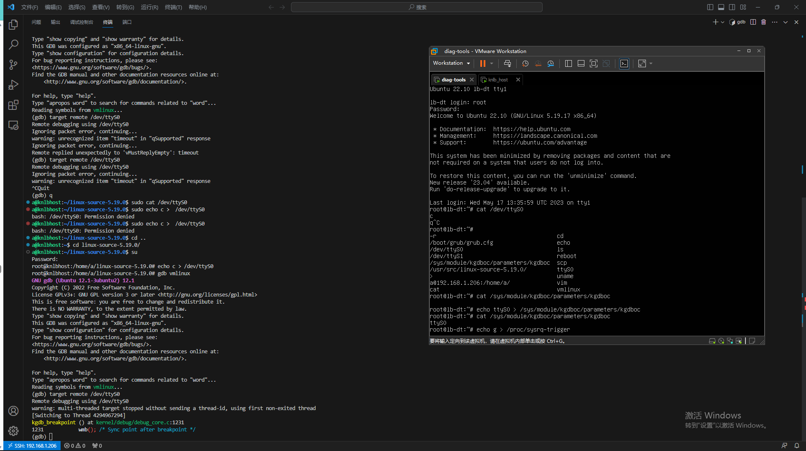

## 内核调试

‍内核模块与内核是协同配合工作的，在一些复杂的内核环境下使用printk调试内核模块来解决问题变得非常困难。为了弥补在qemu虚拟机中无法模拟复杂内核环境找出问题的缺点，远程调试Linux内核变得尤为重要。

### 被调试端

使用kgdb需要的内核配置在较新的发行版（ubuntu22.10）中都已被默认开启。不用再费心配置，但可以点击下面网址了解以下：[https://blog.csdn.net/weixin_39829501/article/details/111040553#t1](https://blog.csdn.net/weixin_39829501/article/details/111040553#t1)

如果要调试修改过的内核，使用以下命令重新编译安装内核

```bash
sudo apt install linux-source
cd /usr/src/
sudo tar -xf linux-source.tar.bz2
cd linux-source-*/
sudo make olddefconfig
sudo make localmodconfig
sudo make
sudo make modules_install
sudo make install
sudo update-grub
```

> 如果你只是为了学习一下Linux，而不是自己修改了一些文件必须重新编译内核，你也可以选择下载别人的编译结果，这非常方便。参考这篇[Ubuntu Wiki](https://link.zhihu.com/?target=https%3A//wiki.ubuntu.com/Debug%2520Symbol%2520Packages%23Getting_-dbgsym.ddeb_packages)。
>
> 首先，我们通过下面的命令创建`/etc/apt/sources.list.d/ddebs.list`​，更新列表。
>
> ```text
>  echo "deb http://ddebs.ubuntu.com $(lsb_release -cs) main restricted universe multiverse
>  deb http://ddebs.ubuntu.com $(lsb_release -cs)-updates main restricted universe multiverse
>  deb http://ddebs.ubuntu.com $(lsb_release -cs)-proposed main restricted universe multiverse" | \
>  sudo tee -a /etc/apt/sources.list.d/ddebs.list
>  sudo apt install ubuntu-dbgsym-keyring
>  sudo apt-get update
> ```
>
> 然后可以下载带有调试信息的image。
>
> ```text
>  sudo apt-get install linux-image-`uname -r`-dbgsym
> ```
>
> vmlinux在`/usr/lib/debug/boot/vmlinux-`uname -r``​，把他拿出来就可以调试了。
>
> [Linux内核调试环境搭建 - 知乎 (zhihu.com)](https://zhuanlan.zhihu.com/p/509070813)

设置开机选项，编辑 `/etc/default/grub`​ 在系统启动参数里加入 `kgdboc=ttyS1,115200 nokalsr`​，主要是为了关闭nokaslr（内核地址随机化）方便调试，kgdboc选项可以开机后设置。

使用以下命令将符号信息传输到调试端：

```bash
scp <your kernel code dir> <your module code dir> <user name>@<debugger ip address>:<a path>
```

之后需要输入调试端用户密码，便传输成功了，感觉在不需要实时同步的场景下比共享文件夹好用。

关闭被调试端，在vm设置中添加串行端口并使用下图中的设置：


开机，配置串行端口（`com_1`​一般对应`ttyS0`​）

```bash
# root用户
echo ttyS0,115200 > /sys/module/kgdboc/parameter/kgdboc
```

进入假死被调试模式

```bash
# root
echo g > /proc/sysrq-trigger
```

### 调试端

关机后同样添加一个串口并如下配置：


开机，调试端的编译过的Linux内核源代码目录、内核模块目录确保拷贝到了调试端，然后执行如下命令

```bash
# root用户
stty -F /dev/ttyS0 115200 # 修改设备波特率
gdb vmlinux # Linux内核源代码目录中
(gdb) set detach-on-fork on # 不跟踪子进程
(gdb) target remote /dev/ttyS0 # 连接被调试端
(gdb) set scheduler-locking step # 当命中时跳到命中线程，并停止全部线程
```

### 效果图

注：vscode连接了调试端，vm当前窗口显示被调试端。



在gdb中使用`info threads`​查看所有线程的信息：


其中括号中为线程名，前几个名称以`shadowCPU`开头的线程表示在每个CPU上的线程，可见在当前被调试端锁定时只有挂起函数在运行。之后的线程即为被调试端上的所有真实线程。可以使用`thread <thread id>`命令设置断点线程。

## 模块段地址信息

使用`cat /proc/modules | grep <module_name>`​来查看内核模块在内存中的起始位置：


依照上述结果，使用以下命令在gdb中添加模块的符号信息：

```c
add-symbol-file <module_file_path> 0xffffffffa06a90a0
```
## 添加硬断点

因为调试端添加软件断点`breakpoint`只是在本地内存进行添加，无法添加到被调试端的内存中，所以这里需要使用硬断点`hbreak`，将断点地址存入被调试端的断点寄存器中，即可使被调试端在运行到相应地址时挂起，使调试端的gdb获得干预的机会。但是因为断点寄存器的数量较少，最多只能设置硬件寄存器数量的硬件断点。

使用方法和`breakpoint`一致，在`hbreak`后面可以跟相应跟踪的内核模块符号或者地址。

如果想设置更多的硬件断点，可以在内核模块代码中添加`kgdb_breakpoint()`，来使内核模块运行到对应位置时主动挂起内核。

# 查找kgdb跟踪点

> 在gdb终端内输入c，内核将继续完成初始化工作，进入系统，此时是无法在gdb中主动停止运行的，因为内核的调试是一种被动调试，如果内核没有主动进入断点也没有触发断点指令，gdb是无法将内核进入调试状态的
>
> [https://blog.csdn.net/weixin_39871788/article/details/120313821#t15](https://blog.csdn.net/weixin_39871788/article/details/120313821#t15)

所以，我们需要是被调试的代码主动陷入断点指令，为此，考察`/proc/sysrq-trigger`​文件的实现代码。

通过在源代码根目录下搜索文本`sysrq-trigger`​，找到了sysrq设备代码，其中通过输入字符返回对应处理函数结构的代码：

```c
// in <drivers/tty/sysrq.c>
/*
 * get and put functions for the table, exposed to modules.
 */
static const struct sysrq_key_op *__sysrq_get_key_op(int key)
{
	const struct sysrq_key_op *op_p = NULL;
	int i;

	i = sysrq_key_table_key2index(key);
	if (i != -1)
		op_p = sysrq_key_table[i];

	return op_p;
}
```

其返回的处理结构为`sysrq_key_op`​，通过对此结构的搜索，找到`debug_core`​代码，其中发现了此结构的一个实例：

```c
// in <kernel/debug/debug_core.c>
static const struct sysrq_key_op sysrq_dbg_op = {
	.handler	= sysrq_handle_dbg,
	.help_msg	= "debug(g)",
	.action_msg	= "DEBUG",
};
```

找到了`g`​对应的处理函数：

```c
// in <kernel/debug/debug_core.c>
#ifdef CONFIG_MAGIC_SYSRQ
static void sysrq_handle_dbg(int key)
{
	if (!dbg_io_ops) {
		pr_crit("ERROR: No KGDB I/O module available\n");
		return;
	}
	if (!kgdb_connected) {
#ifdef CONFIG_KGDB_KDB
		if (!dbg_kdb_mode)
			pr_crit("KGDB or $3#33 for KDB\n");
#else
		pr_crit("Entering KGDB\n");
#endif
	}

	kgdb_breakpoint();
}
```

可见，其会调用kgdb_breakpoint使内核进入假死状态：

```c
/**
 * kgdb_breakpoint - generate breakpoint exception
 *
 * This function will generate a breakpoint exception.  It is used at the
 * beginning of a program to sync up with a debugger and can be used
 * otherwise as a quick means to stop program execution and "break" into
 * the debugger.
 */
noinline void kgdb_breakpoint(void)
{
	atomic_inc(&kgdb_setting_breakpoint);
	wmb(); /* Sync point before breakpoint */
	arch_kgdb_breakpoint();
	wmb(); /* Sync point after breakpoint */
	atomic_dec(&kgdb_setting_breakpoint);
}
EXPORT_SYMBOL_GPL(kgdb_breakpoint);
```

刚好内核主动导出了该函数，方便我们对内核模块的调试。

接着kernel debugger处理结构实例`sysrq_dbg_op`​向外查找，我们可以看到其被以下函数注册，我们可以使用这个接口`register_sysrq_key`​注册未被注册过的大写字母和对应的自定义内核处理函数

```c
// in <kernel/debug/debug_core.c>
static void kgdb_register_callbacks(void)
{
	if (!kgdb_io_module_registered) {
		kgdb_io_module_registered = 1;
		kgdb_arch_init();
		if (!dbg_is_early)
			kgdb_arch_late();
		register_module_notifier(&dbg_module_load_nb);
		register_reboot_notifier(&dbg_reboot_notifier);
#ifdef CONFIG_MAGIC_SYSRQ
		register_sysrq_key('g', &sysrq_dbg_op);
#endif
		if (kgdb_use_con && !kgdb_con_registered) {
			register_console(&kgdbcons);
			kgdb_con_registered = 1;
		}
	}
}
```

其被下面的函数调用：

```c
/**
 *	kgdb_register_io_module - register KGDB IO module
 *	@new_dbg_io_ops: the io ops vector
 *
 *	Register it with the KGDB core.
 */
int kgdb_register_io_module(struct kgdb_io *new_dbg_io_ops)
{
	struct kgdb_io *old_dbg_io_ops;
	int err;

	spin_lock(&kgdb_registration_lock);

	old_dbg_io_ops = dbg_io_ops;
	if (old_dbg_io_ops) {
		if (!old_dbg_io_ops->deinit) {
			spin_unlock(&kgdb_registration_lock);

			pr_err("KGDB I/O driver %s can't replace %s.\n",
				new_dbg_io_ops->name, old_dbg_io_ops->name);
			return -EBUSY;
		}
		pr_info("Replacing I/O driver %s with %s\n",
			old_dbg_io_ops->name, new_dbg_io_ops->name);
	}

	if (new_dbg_io_ops->init) {
		err = new_dbg_io_ops->init();
		if (err) {
			spin_unlock(&kgdb_registration_lock);
			return err;
		}
	}

	dbg_io_ops = new_dbg_io_ops;

	spin_unlock(&kgdb_registration_lock);

	if (old_dbg_io_ops) {
		old_dbg_io_ops->deinit();
		return 0;
	}

	pr_info("Registered I/O driver %s\n", new_dbg_io_ops->name);

	/* Arm KGDB now. */
	kgdb_register_callbacks();

	if (kgdb_break_asap &&
	    (!dbg_is_early || IS_ENABLED(CONFIG_ARCH_HAS_EARLY_DEBUG)))
		kgdb_initial_breakpoint();

	return 0;
}
EXPORT_SYMBOL_GPL(kgdb_register_io_module);
```

