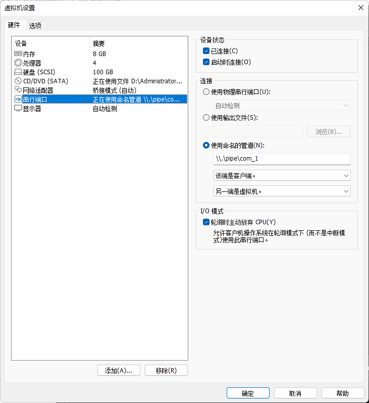
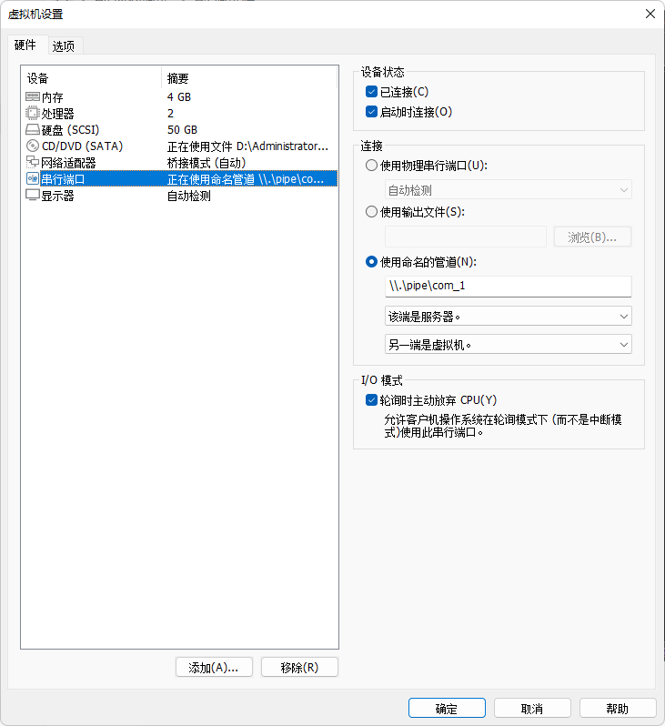

<div align="center"><h1><b>决赛技术报告</b></h1></div>


[TOC]


## 一、项目介绍

选题：proj208-performance-and-diagnosis-tool

项目名称：高负载下性能分析与异常诊断工具

随着现代操作系统的发展，在当前众多的计算机系统中，由于应用负载和系统复杂度的不断提高，系统在高负载情况下可能会出现性能问题和异常情况，而传统的用户态常用的性能工具在高负载情况下常常会失效，表现不佳，无法提供准确的诊断结果，给用户带来不便和风险，这时一个具有高性能、高可靠性 ，同时对系统影响低、准确性强的性能分析和异常诊断工具就显得尤为重要。因此，本项目旨在开发一种高负载情况下的高性能工具，用于分析各类异常情况并对系统进行故障诊断，对于提高系统的性能和稳定性也具有重要意义。

本项目工具实现后应该具有以下特征：

- 高性能：该工具需要在高负载情况下保持较高的性能，能够实时监控系统的各项指标，并能够对各种异常情况进行快速分析和诊断。
- 高可靠性：该工具需要保证在各种复杂的环境下都能够正常工作，而且能够准确地诊断和分析各种异常情况，提供准确的故障诊断报告。
- 对系统影响低：该工具需要在后台运行并对系统的性能影响尽可能小，不会影响到系统的正常运行。
- 准确性强：该工具需要提供准确的诊断结果，不会给用户带来误导和风险，并且支持多种异常情况的诊断。
- 易用性好：该工具需要提供友好的用户界面，简单易用。用户能够通过界面直观地了解系统的运行情况和异常情况，并能够快速地找到解决问题的方法。

本项目的预期目标如下：

- 编写性能工具，采集有关数据，输出火焰图。
- 能够在高负载下进行压力测试，并可靠地完成性能监测和异常分析。
- 在高负载场景下，对工具进行测试，寻找可优化的部分。

## 二、相关资料调研

在高负载下进行性能分析和故障诊断是一项非常复杂和挑战性的任务，需要掌握足够的技术和工具，才能够准确地找到程序中的性能瓶颈，提高系统的运行效率和稳定性。

以下是一些常见的性能分析、异常诊断技术和工具介绍：

1. 内核模块：内核模块（Kernel Module）是一种可以动态加载和卸载到内核中的可执行代码，它可以扩展和增强操作系统的功能。内核模块通常编写为C程序，可以访问操作系统内核的数据结构和函数，并在系统启动时加载，以便为系统提供额外的功能和服务。在性能分析和故障诊断方面，内核模块可以通过跟踪系统调用、监测内核函数调用和分析内核数据结构等方面来帮助找到系统的性能瓶颈和故障点。通过内核模块，可以动态地监测内核状态，了解系统内部的运行机制，快速地定位和解决问题。
2. eBPF：eBPF是一个能够在内核运行沙箱程序的技术，提供了一种在内核事件和用户程序事件发生时安全注入代码的机制，使得非内核开发人员也可以对内核进行控制。随着内核的发展，eBPF 逐步从最初的数据包过滤扩展到了网络、内核、安全、跟踪等，而且它的功能特性还在快速发展中，早期的 BPF 被称为经典 BPF，简称cBPF，正是这种功能扩展，使得现在的BPF被称为扩展BPF，简称eBPF。eBPF技术可以在内核空间中执行用户自定义的代码，并以非常低的开销捕获和处理网络数据包、系统调用、内核函数调用等等。eBPF技术可以通过监测各种系统事件和数据，如CPU使用率、内存分配、文件系统访问、网络数据包等，提供实时的、精准的、低开销的监测和分析。
3. DTrace：DTrace是一种功能强大的跨平台性能分析和故障诊断工具，DTrace的主要特点是它可以在运行时对应用程序和操作系统进行深入的跟踪和分析，而且不需要重新编译或重启系统。它可以跟踪各种系统活动，例如系统调用、内核事件、用户态应用程序的函数调用、文件系统操作等等，它还可以通过用户自定义的脚本来收集和分析数据，并提供非常丰富的数据可视化和分析工具。
4. Linux性能工具箱：Linux性能工具箱是一组命令行工具，用于在Linux系统中进行性能分析和调试，可以帮助开发人员和系统管理员识别性能瓶颈，优化系统和应用程序的性能，以及诊断和解决各种问题。以下是一些常见的Linux性能工具箱组件：
   - top：top命令是一个实时性能监控工具，可以显示系统的资源使用情况，包括CPU、内存、I/O等。
   - vmstat：vmstat命令可以显示Linux系统的虚拟内存统计信息，通过vmstat命令可以查看系统的负载情况，以及系统内部的运行状况。
   - strace：strace命令可以跟踪进程的系统调用，通过strace命令可以查看应用程序和系统之间的交互，以及应用程序的性能瓶颈。
   - perf：perf命令是一个性能分析工具，可以用于跟踪进程的CPU使用情况、内存使用情况、锁竞争等性能指标。

本项目旨在开发一种在高负载场景下的性能分析与异常诊断工具，而在这种场景下用户态常用的性能工具常常会失效，因此我们把研究重点放在了内核模块和eBPF上面，经过综合考虑，以及和导师们的探讨，最后选择了使用内核模块的方式去进行工具的开发。

## 三、设计思路

### (一) 技术选择

高负载场景下用户态常用的性能工具可能会失效，原因包括资源竞争、延迟增加、内核态限制和数据冲突。为了避免这些不利因素，选择一个合适的开发技术至关重要，经过网上查阅资料，以及和老师们的沟通，我们得出结论：利用内核模块技术或eBPF技术都可以开发出来一种在高负载场景下具有高性能和高可靠性的工具，至于哪一个技术更合适，以下我们把内核模块技术和eBPF技术进行了对比： 

- 在性能方面
  - 内核模块：内核模块是以编译的形式加载到内核中的，可以直接访问内核的数据结构和功能。由于内核模块运行在内核空间，可以直接操作硬件和内核数据，因此在性能方面通常具有较高的效率。内核模块可以直接使用底层硬件资源，无需通过系统调用等额外开销。
  - eBPF技术：eBPF 是一种可编程的内核扩展技术，允许用户态程序在内核中执行自定义的逻辑。eBPF程序运行在内核空间，但相对于内核模块，eBPF的执行路径更长，需要经过安全检查和JIT编译等步骤。尽管eBPF的性能在不断改进，但与内核模块相比，其性能还是有一定的开销。
- 在可靠性方面
  - 内核模块：内核模块的加载和执行是由内核控制的，具有高度的可靠性。内核模块在编译和加载之前需要进行严格的验证和安全审查，确保其与内核的兼容性和稳定性。由于内核模块直接运行在内核空间，因此可以更好地利用内核提供的保护机制和错误处理机制，提高可靠性和稳定性。
  - eBPF技术：eBPF程序在内核中执行，但其代码由用户态程序员编写，存在一定的安全风险。为了提高安全性，eBPF引入了安全检查和限制，以防止恶意代码对内核的影响。尽管如此，eBPF技术相对于内核模块来说，由于其较新的设计和复杂性，可能存在一些未知的漏洞和问题，可能导致可靠性方面的挑战。
- 在功能实现方面
  - 内核模块：由于内核模块运行在内核空间，因此具有直接访问内核头文件、内核函数以及内核数据的优势，这使得内核模块在实现功能方面更加方便和直接，可以实现的功能也更为全面，因为它可以直接利用内核提供的丰富功能和底层资源，相较于其他实现方式，内核模块的功能实现受到的约束较少。
  - eBPF技术：在编写eBPF程序来实现功能时，实际上会面临一些限制。eBPF程序只能引用特定的头文件并使用特定的eBPF函数，这限制了程序对内核的访问和操作，也就导致eBPF程序无法直接获取内核中的任意数据。此外，在进行函数挂载时，eBPF程序也有一定的限制。它只能挂载到已经存在探针的内核函数上，而无法自由选择挂载点。这也导致了eBPF程序在功能方面的一些局限性。

综上所述，我们选择利用内核模块去进行高负载情形下高性能工具的开发。

### (二) 开发设计

通过项目导师谢宝友老师在赛题中提供的资料，我们在谢老师仓库中发现了开源工具diagnose-tools，diagnose-tools是一个内核诊断工具套件，于是我们打算基于这个工具进行项目开发，在制定好了开发方案后，我们通过和谢老师进行沟通，得到了谢老师的认可，并且谢老师也给了我们很多的开发建议。

目前这个开源工具仍然存在很多可以优化的地方，如下：

- 开源工具diagnose-tools适配的Linux内核版本过低，导致在高版本上无法使用，因此在高版本中的复现工作就显得尤为重要。
- 开源工具diagnose-tools由于调用的都是低版本中的代码，但目前高版本相对于低版本在代码上已经优化了很多，因此对开源工具diagnose-tools的源码进行优化也尤为重要。
- 在功能方面，缺乏确定异常时间点功能、不同业务进程画像功能、负载变化趋势图像功能等。
- 缺乏在高版本中开源工具diagnose-tools的测试，以及测试后的优化。

开发设计的整体思路如下：

1. 在Linux 5.19内核版本上完成 diagnose-tools 工具的复现。
2. 根据Linux 5.19内核源码，对diagnose-tools工具的源代码进行优化完善。
3. 在diagnose-tools 工具原有的功能基础上进行扩充：
   - 确定异常时间点功能
   - 不同业务进程画像功能
   - 负载变化趋势图像功能
4. 进行压力测试，在高负载下寻找可优化的部分。

开发工具原理图如下所示：

<div align='center'></div>

## 四、技术创新

### (一) 工具源码优化

#### 1. sys_delay 源码的优化

在编译通过后，对sys-delay模块进行调试，发现内核卡在了 `JUMP_INSTALL(_cond_resched)`，其调用了 `text_poke_bp` 内核函数，

```mermaid
graph LR
__activate_sys_delay-->1["JUMP_INSTALL(_cond_resched)"]-->orig_text_poke_bp
```

通过对该函数资料的搜索，发现其是一条更换函数实现的指令，工具利用 `text_poke_bp` 在 `_cond_resched` 原有基础上加入了更新工具所记录数据的语句。 `text_poke_bp` 具体资料如下：

> Linux 内核社区在 2009 年提出了 kprobe jump optimization 方案，该方案的思路是通过 `Near JMP` 指令来模拟 `do_int3/kprobe_int3_handler` 中断处理。 该方案在各大发行版里目前默认开启，在当时的优化结果比单步调试快了近 10 倍。虽然它存在一定的局限性，但不妨碍我们了解它，这个方案和后面提到的 ftrace 设计理念一致。
>
> 该优化方案通过修改被观测指令成 `Near JMP` 指令，一旦产生观测事件，CPU 将跳到预定义好的一个代码片段上模拟 `kprobe_int3_handler` 处理逻辑。 但 `Near JMP (Rel32)` 是一个 **五字节** 的指令，如果在指令更新过程中，中间结果被其他 CPU 读取执行了，那么将产生不可预知的行为，这甚至会造成内核崩溃。 为了保证能安全更新被观测指令，kprobe 还是需要依赖 INT3 中断来协助处理指令更新。
>
> 假设我们已经有了模拟 kprobe_int3_handler 的代码片段，为了方便解释，我们将其简称为 **跳板** （虽然方案和文档都称之为 detour buffer，但我觉得 跳板 更容易理解些）。 在这里，我们继续拿之前 `Near CALL` 的观测指令来举例子。被观测指令 `e8 fc 57 77 ff` 被 kprobe 更新成 `INT3[cc] fc 57 77 ff`; 那么任何时刻 CPU 执行这条指令时，它们都会触发 INT3 中断，即使 `fc 57 77 ff` 这个值被改成非法的值，CPU 也不会使用这个值，INT3 给我们形成了天然的屏障，如下图所示。
>
> <div align='center'></div>
>
> kprobe jump 优化方案是一个异步的操作，该方案会触发一个 kworker 来执行被观测指令的更新。那么在指令更新前，CPU 还是可以会触发观测事件，这个时候的处理链路还是会走到 `kprobe_int3_handler/setup_singlestep` 。但它并非使用前面提到的指令模拟，而是直接通过 `setup_detour_execution` 将寄存器的 EIP 转化成 **跳板** 代码指令地址上，相当于模拟了一次更新后的 `Near JMP` 指令。如果 kworker 开始调用 `text_poke_bp` ，那么内核会告知所有 CPU，有一个 CPU 当前正在处理指令升级。如果其他 CPU 触发了该指令的 INT3 中断，那么 CPU 将会进入到 `poke_int3_handler` 中断处理逻辑，同样的它会根据指令来调用不同的模拟逻辑：在 kprobe 指令优化场景下，`poke_int3_handler` 将会调用 `int3_emulate_jmp` 模拟逻辑，效果和前面提到的 `setup_detour_execution` 一致。那么有了 INT3 中断这一屏障后，`text_poke_bp` 就可以放心更新指令了，其中 `text_poke_bp` 更新有三步：
>
> 1. 指令首地址 opcode 更新成 INT3，确保 `poke_int3_handler` 能模拟预期的行为；
> 2. 将指令后半部分更新成预期的值;
> 3. 将指令的首地址 opcode 更新成预期的值。
>
> `text_poke_bp` 每一步更新都会同步给所有 CPU，确保它们读到的都是最新的指令内容。
>
> <div align='center'></div>
>
> 在 kprobe 场景下，最终被观测指令将会变成跳到 **跳板** 的指令，而这跳板里的指令内容如上图所示。 跳板上的指令由 `arch_prepare_optimized_kprobe` 代码生成，其中 `optimized_callback` 用来执行 kprobe 的 `pre_handler`。 跳板指令最后为被观测指令的 **副本** 以及跳回到被观测指令的下一指令，其中这个副本并非直接拷贝原来的指令。 对于 `Near CALL` 或者 `Near JMP` 等具有相对位置的指令，我们需要根据当前跳板和被观测指令之间的差值来更新指令，这样才可以确保被观测指令可以离线运行，原理和单步调试里的 `resume_execution` 类似。
>
> 这个优化效果十分显著，但它对被观测指令有一定的要求。在前面我举的例子里，被观测指令的长度和 `Near JMP` 指令长度一致，所以被修改的指令仅一条。 **但在 x86_64 架构里，指令长度是变长编码，常用的指令编码需要的字节少，而不常用的字节多。如果被观测的指令短于五字节，那么指令修改必定涉及到多条。 而 `text_poke_bp` 更新的指令如果跨越了多个指令，那么 INT3 中断将无法保证中间修改的状态不被访问。**假设某一条指令可以跳过 INT3 指令访问正在修改的值， 那么 CPU 执行时必然会出现不可预知的情况。因此 kprobe 会通过 `can_optimize` 来扫描被观测指令所在函数的每一条指令，以确保可使用跳板模式来优化。
>
> 总的来说，这个优化方案要求被观测指令不能涉及到异常处理、不能出现跳跃到被修改指令的中间位置以及被观测指令是可以脱离原上下文离线运行的。 有一定的局限性，但如果我们想要观测某一个函数入口时，我们还是可以使用上这个优化。

总的来说，由于 `text_poke_bp` 对指令的修改过程不是原子性的，在x86架构中可能会发生访问正在被修改值的情况而发生不可预料的错误。

为了解决这种情况，我浏览了kprobe通过指令跳板优化跟踪点的实现，在5.19内核版本的源码中，kprobe在优化过程中会判断指令可不可以被优化，会调用 `can_optimize` 函数来解码整个函数以确保任何指令不会跳入目标。

```mermaid
graph LR
register_kprobe-->try_to_optimize_kprobe-->alloc_aggr_kprobe-->__prepare_optimized_kprobe-->arch_prepare_optimized_kprobe-->can_optimize
```

又因为新的 `__cond_resched` 实现可以被拆分为 `pre_handle` 和 旧的 `__cond_resched`，所以这里使用了 kprobe 来替代指令跳板的实现，可能会因无法优化损失掉 `__cond_resched` 跳板带来的性能上的提高，但**保证了机器运行状态的安全和代码的稳定性**。

#### 2. perf 源码的优化

在新版本内核中 perf 使用的操作cpu接口发生了变化，通过新旧内核版本源代码使用示例的对比，找到了等价的函数：

在旧内核版本（Linux 3.10内核版本）中的 schedule_on_each_cpu 函数中：

```c
int schedule_on_each_cpu(work_func_t func)
{
	//...
	get_online_cpus();
	//...
	put_online_cpus();
	//...
}
```

在新内核版本（Linux 5.19内核版本）中的 schedule_on_each_cpu 函数中：

```c
int schedule_on_each_cpu(work_func_t func)
{
	//...
	cpus_read_lock();
	//...
	cpus_read_unlock();
	//...
}
```

在perf中将 get_online_cpus() 函数和 put_online_cpus() 函数用 cpus_read_lock()函数和 cpus_read_unlock() 函数替换后成功运行。

#### 3. uprobe 源码的优化

在 Linux 高版本内核中，启动 uprobe 工具后会引起死机的问题，为了解决这一问题，在uprobe工具的源码函数 hook_uprobe() 中删除了一条操作野指针的语句，删除后，文件的引用不会得到释放，于是增加了fput语句：

<div align='center'></div>

最后uprobe工具得以成功运行。

#### 4. sched_delay, utilization 源码优化

在 非AliOS的Linux系统中，因为没有AliOS给task_struct新增的预留字段，所以需要预留字段存储task_struct相关性能信息的sched_delay, utilization功能无法使用。

针对这个问题，项目使用HASH表来维护与进程相关的性能信息，利用Linux内核使用的高性能HASH函数来计算键值。

```c
static struct hlist_head ht[STAMP_SIZE];
struct stamp {int pid; unsigned long long time; struct hlist_node node;};

static struct stamp *find_stamp(struct task_struct *p)
{
  //...
	hash_for_each_possible(ht, t, node, hash_long(p->pid, STAMP_BITS)) {
        if (t->pid == p->pid) return t;
    }
    return NULL;
}

static void clean_stamp(void) {
  //...
	hash_for_each_safe(ht, i, tmp, t, node) {
		hash_del(&t->node);
		kfree(t);
    }
}

static unsigned long long read_last_queued(struct task_struct *p) {
	find_stamp(p);
  //...
}
static void update_last_queued(struct task_struct *p, unsigned long long stamp)
{
    //...
	hash_add(ht, &t->node, hash_long(t->pid, STAMP_BITS));
}
```

最后使sched_delay, utilization工具得以成功运行。

### (二) 功能扩充

#### 1. 不同业务的进程画像功能

##### 功能描述

在混部系统中，对不同的业务进程进行画像，是很有意义的事情，不同的业务进程可能是CPU密集型/内存访问密集型/IO密集型，这些异常进程都可能会导致系统异常。为了找到这些进程，设定cpu_ratio、mem_ratio、rwfreq阈值进行过滤，打印可能是CPU密集型/IO密集型/内存密集型的进程信息。

##### 测试用例

终端1：利用stress-ng模拟CPU密集型进程、内存密集型进程、IO密集型进程的指令：

```
stress-ng --vm 1 --vm-bytes 7G --cpu 1 --iomix 1 --iomix-bytes 2M
```

终端2：启动该功能，依次执行如下指令：

```
sudo diagnose-tools task-info --image
sudo diagnose-tools task-info --report_image
```

运行结果：

<div align='center'></div>

#### 2. 负载变化趋势图像功能

##### 功能描述

使用者可以指定一个时间段，在这个时间段内，每隔5秒采集一次1分钟平均负载值、5分钟平均负载值和15分钟平均负载值，随后，可以将这些采集到的数据绘制成折线图，以便使用者能够直观地观察到负载值的变化趋势。

**测试用例**

终端1：启动该功能，执行如下指令：

```
sudo diagnose-tools load-monitor --time=500
```

终端2：利用stress-ng进行加压，执行如下指令：

```
stress-ng --cpu 10
```

终端1：执行`sudo diagnose-tools load-monitor --timeload`指令可以打印出统计的数据，运行结果如下所示：

<div align='center'></div>

终端1：执行`sudo diagnose-tools load-monitor --plot`指令可以将采集到的数据绘制成折线图，运行结果如下所示：

<div align='center'></div>

#### 3. 异常时间点确定功能

##### 功能描述

确定异常时间点可以更好的进行故障排查，在开机后即可将这个功能模块激活（需要指定负载阈值），设置计时器每10ms检查一下一分钟平均负载值，若超过负载阈值，这个工具就会记录：异常时间点（时：分：秒）、1分钟平均负载值、5分钟平均负载值和15分钟平均负载值。

这些记录信息会随着每次异常发生而覆盖更新，以统计最新一次的异常时间点及其负载信息，实现思想如下：

```
若 load >= loadmax && flag ==0 ,则记录信息并令flag=1;
否则 load < loadmax && flag ==1 ,则令flag=0;
```

##### 测试用例

终端1：启动该功能，设置负载阈值为4，运行如下指令：

```
sudo diagnose-tools load-monitor --activate="load=4"
```

终端2：利用stress-ng进行加压，运行如下指令：

```
stress-ng --cpu 10
```

终端1：打开top工具，观察1分钟负载值的变化情况，当load值超过设定负载阈值时，记录异常时间点，执行指令`sudo diagnose-tools load-monitor --report`查看异常时间点信息：

<div align='center'></div>

终端1&2：关闭stress-ng工具使负载值下降到阈值以下，然后重新开启stress-ng工具负载值会再次飙高超过阈值，此时会更新异常时间点，运行结果如下：

<div align='center'></div>

### (三) 压力测试

**nbench**是一款专门用于处理器以及存储器性能测试的基准测试程序，即著名的***BYTE Magazine***杂志的**BYTEmark benchmark program**，nbench在系统中运行并将结果和一台运行Linux的AMD K6-233电脑比较，得到的比值作为性能指数。由于是完全开源的，爱好者可以在各种平台和操作系统上运行Nbench，并进行优化和测试，是一个简单有效的性能测试工具。Nbench的结果主要分为**MEM**、**INT**和**FP**，其中MEM指数主要体现**处理器总线、CACHE和存储器性能**，INT**整数处理性能**，FP则体现**双精度浮点性能**（大多数嵌入式处理器都没有强大的双精度浮点能力）。

**stress-ng** 是一个常用的加压工具，支持多种产生系统负载的方式，包含 CPU 的浮点运算、整数运算、位元运算与控制流程等，可以用来测试系统在高负载的状况下的稳定性。stress-ng 必须小心使用，某些测试可能会造成设计不良的硬件过热，另外也可能让系统过载而难以停止负载测试。

这里我们使用上述两个工具进行测试，测试的硬件环境为

```shell
#测试环境1
OS: Ubuntu 22.10 kinetic
Kernel: x86_64 Linux 5.19.0-43-generic
Uptime: 1d 19h 39m
Packages: 721
Shell: bash 5.2.2
Disk: 23G / 50G (47%)
CPU: Intel Core i7-7700HQ @ 4x 2.808GHz
GPU: VMware SVGA II Adapter
RAM: 2250MiB / 7914MiB
#测试环境2
OS: Ubuntu 22.10 kinetic
Kernel: x86_64 Linux 5.19.0-46-generic
Uptime: 1h 20m
Packages: 605
Shell: bash 5.2.2
Disk: 128G / 300G (42%)
CPU:  13th Gen Intel(R) Core(TM) i5-13490F
GPU: VMware SVGA II Adapter
RAM: 3249MiB / 11955MiB
```


首先利用**nbench**测试系统在无压环境下的性能指数记为$P_0$，系统在 `stress-ng --cpu 8 --io 4 --vm 2 --vm-bytes 128M --fork 4` 压力时测得的性能指数记为$P_1$，测量5次，取指数的平均值$\overline{P_1}、\overline{P_0}$，由此得出工具各模块对性能的影响$D_1=(\overline{P_1}-\overline{P_0})/\overline{P_0}$。如下图所示，影响由百分百表示：

<div align='center'></div>

可见该压力对系统的三种指标都有较大（$-20\%$左右）的损耗。（工具各个模块具体的压测数据见[压测数据.xlsx](https://gitlab.eduxiji.net/202311664111382/project1466467-176202/-/blob/main/压测数据.xlsx)）

有上述压力的同时运行工具各模块时nbench测得的性能指数记为$P_2$，测量5次，取指数的平均值$\overline{P_2}$，由此得出工具各模块在高负载环境下对性能的影响$D_2=(\overline{P_2}-\overline{P_1})/\overline{P_1}$算出。如下图所示：

<div align='center'></div>

在上述压力下，工具各模块对性能的**影响不超过$-2.00\%$** ，由此可以说明工具**对性能的影响较小**。

在上图中除diagnose-tools中原有的功能模块外，对load-trend和task_image（包括负载值变化趋势，异常时间点确定和不同业务进程的画像功能）同样进行压力测试，评估高负载环境下其对系统性能的影响。结果可以看出对系统性能的**影响不超过$-1.00\%$**，由此可以说明高负载情况下扩充的功能**对系统性能**几乎没有影响。

### (四) 内核模块调试环境

##### 内核调试

‍内核模块与内核是协同配合工作的，在一些复杂的内核环境下使用printk调试内核模块来解决问题变得非常困难。为了弥补在qemu虚拟机中无法模拟复杂内核环境找出问题的缺点，远程调试Linux内核变得尤为重要。

###### 被调试端

使用kgdb需要的内核配置在较新的发行版（ubuntu22.10）中都已被默认开启。不用再费心配置，但可以点击下面网址了解以下：[https://blog.csdn.net/weixin_39829501/article/details/111040553#t1](https://blog.csdn.net/weixin_39829501/article/details/111040553#t1)

如果要调试修改过的内核，使用以下命令重新编译安装内核

```bash
sudo apt install linux-source
cd /usr/src/
sudo tar -xf linux-source.tar.bz2
cd linux-source-*/
sudo make olddefconfig
sudo make localmodconfig
sudo make
sudo make modules_install
sudo make install
sudo update-grub
```

> 如果你只是为了学习一下Linux，而不是自己修改了一些文件必须重新编译内核，你也可以选择下载别人的编译结果，这非常方便。参考这篇[Ubuntu Wiki](https://link.zhihu.com/?target=https%3A//wiki.ubuntu.com/Debug%2520Symbol%2520Packages%23Getting_-dbgsym.ddeb_packages)。
>
> 首先，我们通过下面的命令创建`/etc/apt/sources.list.d/ddebs.list`​，更新列表。
>
> ```text
>  echo "deb http://ddebs.ubuntu.com $(lsb_release -cs) main restricted universe multiverse
>  deb http://ddebs.ubuntu.com $(lsb_release -cs)-updates main restricted universe multiverse
>  deb http://ddebs.ubuntu.com $(lsb_release -cs)-proposed main restricted universe multiverse" | \
>  sudo tee -a /etc/apt/sources.list.d/ddebs.list
>  sudo apt install ubuntu-dbgsym-keyring
>  sudo apt-get update
> ```
>
> 然后可以下载带有调试信息的image。
>
> ```text
>  sudo apt-get install linux-image-`uname -r`-dbgsym
> ```
>
> vmlinux在`/usr/lib/debug/boot/vmlinux-`uname -r``​，把他拿出来就可以调试了。
>
> [Linux内核调试环境搭建 - 知乎 (zhihu.com)](https://zhuanlan.zhihu.com/p/509070813)

设置开机选项，编辑 `/etc/default/grub`​ 在系统启动参数里加入 `kgdboc=ttyS1,115200 nokalsr`​，主要是为了关闭nokaslr（内核地址随机化）方便调试，kgdboc选项可以开机后设置。

使用以下命令将符号信息传输到调试端：

```bash
scp <your kernel code dir> <your module code dir> <user name>@<debugger ip address>:<a path>
```

之后需要输入调试端用户密码，便传输成功了，感觉在不需要实时同步的场景下比共享文件夹好用。

关闭被调试端，在vm设置中添加串行端口并使用下图中的设置：



开机，配置串行端口（`com_1`​一般对应`ttyS0`​）

```bash
# root用户
echo ttyS0,115200 > /sys/module/kgdboc/parameter/kgdboc
```

进入假死被调试模式

```bash
# root
echo g > /proc/sysrq-trigger
```

###### 调试端

关机后同样添加一个串口并如下配置：



开机，调试端的编译过的Linux内核源代码目录、内核模块目录确保拷贝到了调试端，然后执行如下命令

```bash
# root用户
stty -F /dev/ttyS0 115200 # 修改设备波特率
gdb vmlinux # Linux内核源代码目录中
(gdb) set detach-on-fork on # 不跟踪子进程
(gdb) target remote /dev/ttyS0 # 连接被调试端
(gdb) set scheduler-locking step # 当命中时跳到命中线程，并停止全部线程
```

###### 效果图

注：vscode连接了调试端，vm当前窗口显示被调试端。


在gdb中使用`info threads`​查看所有线程的信息：


其中括号中为线程名，前几个名称以`shadowCPU`开头的线程表示在每个CPU上的线程，可见在当前被调试端锁定时只有挂起函数在运行。之后的线程即为被调试端上的所有真实线程。可以使用`thread <thread id>`命令设置断点线程。

##### 模块段地址信息

使用`cat /proc/modules | grep <module_name>`​来查看内核模块在内存中的起始位置：


依照上述结果，使用以下命令在gdb中添加模块的符号信息：

```c
add-symbol-file <module_file_path> 0xffffffffa06a90a0
```
##### 添加硬断点

因为调试端添加软件断点`breakpoint`只是在本地内存进行添加，无法添加到被调试端的内存中，所以这里需要使用硬断点`hbreak`，将断点地址存入被调试端的断点寄存器中，即可使被调试端在运行到相应地址时挂起，使调试端的gdb获得干预的机会。但是因为断点寄存器的数量较少，最多只能设置硬件寄存器数量的硬件断点。

使用方法和`breakpoint`一致，在`hbreak`后面可以跟相应跟踪的内核模块符号或者地址。

如果想设置更多的硬件断点，可以在内核模块代码中添加`kgdb_breakpoint()`，来使内核模块运行到对应位置时主动挂起内核。

#### 查找kgdb跟踪点

> 在gdb终端内输入c，内核将继续完成初始化工作，进入系统，此时是无法在gdb中主动停止运行的，因为内核的调试是一种被动调试，如果内核没有主动进入断点也没有触发断点指令，gdb是无法将内核进入调试状态的
>
> [https://blog.csdn.net/weixin_39871788/article/details/120313821#t15](https://blog.csdn.net/weixin_39871788/article/details/120313821#t15)

所以，我们需要是被调试的代码主动陷入断点指令，为此，考察`/proc/sysrq-trigger`​文件的实现代码。

通过在源代码根目录下搜索文本`sysrq-trigger`​，找到了sysrq设备代码，其中通过输入字符返回对应处理函数结构的代码：

```c
// in <drivers/tty/sysrq.c>
/*
 * get and put functions for the table, exposed to modules.
 */
static const struct sysrq_key_op *__sysrq_get_key_op(int key)
{
	const struct sysrq_key_op *op_p = NULL;
	int i;

	i = sysrq_key_table_key2index(key);
	if (i != -1)
		op_p = sysrq_key_table[i];

	return op_p;
}
```

其返回的处理结构为`sysrq_key_op`​，通过对此结构的搜索，找到`debug_core`​代码，其中发现了此结构的一个实例：

```c
// in <kernel/debug/debug_core.c>
static const struct sysrq_key_op sysrq_dbg_op = {
	.handler	= sysrq_handle_dbg,
	.help_msg	= "debug(g)",
	.action_msg	= "DEBUG",
};
```

找到了`g`​对应的处理函数：

```c
// in <kernel/debug/debug_core.c>
#ifdef CONFIG_MAGIC_SYSRQ
static void sysrq_handle_dbg(int key)
{
	if (!dbg_io_ops) {
		pr_crit("ERROR: No KGDB I/O module available\n");
		return;
	}
	if (!kgdb_connected) {
#ifdef CONFIG_KGDB_KDB
		if (!dbg_kdb_mode)
			pr_crit("KGDB or $3#33 for KDB\n");
#else
		pr_crit("Entering KGDB\n");
#endif
	}

	kgdb_breakpoint();
}
```

可见，其会调用kgdb_breakpoint使内核进入假死状态：

```c
/**
 * kgdb_breakpoint - generate breakpoint exception
 *
 * This function will generate a breakpoint exception.  It is used at the
 * beginning of a program to sync up with a debugger and can be used
 * otherwise as a quick means to stop program execution and "break" into
 * the debugger.
 */
noinline void kgdb_breakpoint(void)
{
	atomic_inc(&kgdb_setting_breakpoint);
	wmb(); /* Sync point before breakpoint */
	arch_kgdb_breakpoint();
	wmb(); /* Sync point after breakpoint */
	atomic_dec(&kgdb_setting_breakpoint);
}
EXPORT_SYMBOL_GPL(kgdb_breakpoint);
```

刚好内核主动导出了该函数，方便我们对内核模块的调试。

接着kernel debugger处理结构实例`sysrq_dbg_op`​向外查找，我们可以看到其被以下函数注册，我们可以使用这个接口`register_sysrq_key`​注册未被注册过的大写字母和对应的自定义内核处理函数

```c
// in <kernel/debug/debug_core.c>
static void kgdb_register_callbacks(void)
{
	if (!kgdb_io_module_registered) {
		kgdb_io_module_registered = 1;
		kgdb_arch_init();
		if (!dbg_is_early)
			kgdb_arch_late();
		register_module_notifier(&dbg_module_load_nb);
		register_reboot_notifier(&dbg_reboot_notifier);
#ifdef CONFIG_MAGIC_SYSRQ
		register_sysrq_key('g', &sysrq_dbg_op);
#endif
		if (kgdb_use_con && !kgdb_con_registered) {
			register_console(&kgdbcons);
			kgdb_con_registered = 1;
		}
	}
}
```

其被下面的函数调用：

```c
/**
 *	kgdb_register_io_module - register KGDB IO module
 *	@new_dbg_io_ops: the io ops vector
 *
 *	Register it with the KGDB core.
 */
int kgdb_register_io_module(struct kgdb_io *new_dbg_io_ops)
{
	struct kgdb_io *old_dbg_io_ops;
	int err;

	spin_lock(&kgdb_registration_lock);

	old_dbg_io_ops = dbg_io_ops;
	if (old_dbg_io_ops) {
		if (!old_dbg_io_ops->deinit) {
			spin_unlock(&kgdb_registration_lock);

			pr_err("KGDB I/O driver %s can't replace %s.\n",
				new_dbg_io_ops->name, old_dbg_io_ops->name);
			return -EBUSY;
		}
		pr_info("Replacing I/O driver %s with %s\n",
			old_dbg_io_ops->name, new_dbg_io_ops->name);
	}

	if (new_dbg_io_ops->init) {
		err = new_dbg_io_ops->init();
		if (err) {
			spin_unlock(&kgdb_registration_lock);
			return err;
		}
	}

	dbg_io_ops = new_dbg_io_ops;

	spin_unlock(&kgdb_registration_lock);

	if (old_dbg_io_ops) {
		old_dbg_io_ops->deinit();
		return 0;
	}

	pr_info("Registered I/O driver %s\n", new_dbg_io_ops->name);

	/* Arm KGDB now. */
	kgdb_register_callbacks();

	if (kgdb_break_asap &&
	    (!dbg_is_early || IS_ENABLED(CONFIG_ARCH_HAS_EARLY_DEBUG)))
		kgdb_initial_breakpoint();

	return 0;
}
EXPORT_SYMBOL_GPL(kgdb_register_io_module);
```


## 五、内核模块与eBPF程序的实验对比（冰）

## 六、项目成果

### (一) diagnose-tools

目前，我们已经基本实现了开源工具diagnose-tools在高版本（Linux 5.19内核）中的复现和源码优化，以及在原有的功能基础上进行扩充，经汇总后的diagnose-tools工具介绍如下所示，一共20个子工具：

| 工具名称        | 功能描述                                                     |
| :-------------- | :----------------------------------------------------------- |
| 实用小工具pupil | 按照tid查询特定线程在主机上的PID/进程名称/进程链/堆栈等等。**基于此工具，我们又扩充了不同业务进程的画像功能** |
| sys-delay       | 监控syscall长时间运行引起调度不及时。间接引起系统Load高、业务RT高 |
| sys-cost        | 统计系统调用的次数及时间                                     |
| irq-delay       | 监控中断被延迟的时间                                         |
| irq-stats       | 统计中断/软中断执行次数及时间                                |
| irq-trace       | 跟踪系统中IRQ/定时器的执行                                   |
| load-monitor    | 监控系统Load值。每10ms查看一下系统当前Load，超过特定值时，输出任务堆栈。这个功能多次在线上抓到重大BUG。**基于此工具，我们又扩充了负载变化趋势图象功能和异常时间点的确定功能** |
| run-trace       | 监控进程在某一段时间段内，在用户态/内核态运行情况            |
| perf            | 对线程/进程进行性能采样，抓取用户态/内核态调用链             |
| kprobe          | 在内核任意函数中，利用kprobe监控其执行，并输出火焰图         |
| uprobe          | 在用户态应用程序中使用探针，在应用中挂接钩子                 |
| exit-monitor    | 监控任务退出。在退出时，打印任务的用户态堆栈信息             |
| mutex-monitor   | 监控长时间持有mutex的流程                                    |
| exec-monitor    | 监控进程调用exec系统调用创建新进程                           |
| alloc-top       | 统计内存分配数量，按序输出内存分配多的进程                   |
| high-order      | 监控分配大内存的调用链                                       |
| reboot          | 监控系统重启信息，打印出调用sys_reboot系统调用的进程名称以及进程链 |
| sched-delay     | 监控系统调度延迟。找到引起调度延迟的进程                     |
| utilization     | 监控系统资源利用率，找到CPU被哪些野进程干扰，以及进程对内存的使用情况 |
| drop-packet     | 监控内核TCP/IP各个流程中的丢包                               |

开源工具diagnose-tools在高版本（Linux 5.19内核）中功能的演示：

执行指令`uname -r`，查看内核的版本：

<div align='center'></div>

在使用模块功能之前，需要使用`sudo diagnose-tools install`命令安装KO模块：

<div align='center'></div>

可以看到已经成功安装，这里以 load-monitor 功能为例，进行使用说明。

执行指令 `diagnose-tools load-monitor --activate="load=6"` ，设置负载阈值为6，运行结果：

<div align='center'></div>

可以看到该功能已经成功被激活，使用stress-ng进行加压到6后，执行指令 `diagnose-tools load-monitor --report > load-monitor.log` 将结果输出到日志文件 load-monitor.log 中，然后执行指令 `diagnose-tools flame --input=load-monitor.log --output=load-monitor.svg` 将 load-monitor.log 中捕获的信息生成火焰图：

<div align='center'></div>

最后执行指令`diagnose-tools load-monitor --deactivate`即可退出该功能模块。

其他功能也采用类似的方法进行使用，这里就不过多演示，详见[工具使用说明](https://gitlab.eduxiji.net/202311664111382/project1466467-176202/-/tree/main/工具使用说明)。

### (二) 安卓上的移植

目前已经完成了diagnose-tools工具内核模块部分的移植工作，并成功insmod到了安卓手机中，详见[Android_transplant](https://gitlab.eduxiji.net/202311664111382/project1466467-176202/-/tree/main/Android_transplant)，具体insmod操作如下：

将安卓手机连接至虚拟机：

<div align='center'></div>

在虚拟机终端利用 adb push 命令将已经编译好的 diagnose-tools 内核模块部分 diagnose.ko 复制到安卓系统的 /data/local/tmp 文件夹中：

<div align='center'></div>

在虚拟机终端执行指令 adb shell 进入安卓系统终端界面，然后将 /data/local/tmp 文件夹中的 diagnose.ko 进行插入内核：

<div align='center'></div>

查看是否已经插入成功，执行指令 ls dev | grep diagnose-tools：

<div align='center'></div>

可以看到 dev 目录中已经存在 diagnose-tools，说明已经插入成功

用户空间的移植还在开发中，敬请期待 ~

## 七、问题及其解决（冰波恒，补充）

### (一) 利用eBPF技术开发该工具遇到的问题

- 问题描述：在编写libbpf程序获取avenrun[0] (即一分钟平均负载值) 的过程中，由于avenrun数组是全局变量，也就意味着无法通过挂载函数来实现读取这一变量中的值。

  解决办法：通过在/proc/kallsyms文件中读取avenrun变量的地址，然后通过用户态程序传入到内核态程序，最后内核态程序调用 bpf_probe_read_kernel() 函数读到这一变量值。这一问题虽然得到了一个很好的解决，但每次都要通过用户空间程序读取avenrun变量的地址，这在高负载环境下是非常不友好的。

- 问题描述：如何利用eBPF技术去获取进程的堆栈信息？

  解决办法：这个问题的关键在于如何利用libbpf程序去遍历进程，我们通过在网上查询发现可以通过BPF迭代器去解决这个问题，迭代器类型选择 iter/task ，运行结果如下图所示，但是发现用户态堆栈的信息打印不完全，如果想解决这个问题，仍得通过符号表，这避免不了和用户态程序进行频繁的交互，这同样在高负载环境下是非常不友好的。

<div align='center'></div>

### (二) 开发技术的选择

- 问题描述：针对赛题要求，我们应该在内核模块和eBPF技术之间如何抉择呢？

  解决办法：每个技术都有每个技术的应用场景，也都有各自的利弊，尽管eBPF技术相对来说更加灵活，但是从上文（一）中我们可以看到eBPF的局限性以及它实现功能的复杂性，因此考虑到我们需要一个功能更加强大、在高负载下性能更好、更加可靠的解决方案，最终我选择了内核模块。

### (三) 开源工具diagnosis-tool在高版本中复现遇到的问题

- 问题描述：众所周知把一个在低版本上运行的工具在高本版上复现是一件非常不容易的事情，在这个过程中可以说是问题不断，主要碰到的问题就是低版本工具中的函数在高版本中不存在，数据结构及其字段也发生了很大的变化

  解决办法：首先确定出现问题的低版本函数功能，然后在高版本源码中寻找与其功能相同的函数，同样数据结构及其字段也采用同样的方法，虽然我们目前已经成功将该工具在高版本上跑通，但是有些功能还是未能实现，我们目前仍在完善该工具的代码，以下是我们做出的部分修改展示，可以作为参考，后期会根据进展对这些代码进行开源

<div align='center'></div>

### (四) 利用内核模块提取数据的准确性

- 问题描述：在对diagnose-tools工具进行功能扩展时，虽然利用内核模块编写程序来收集数据非常方便，但是如何进行数据的处理并不是一件容易的事情，如果只凭主观想法去对数据进行处理，计算出cpu利用率、内存利用率、每秒读写频率等指标，那么这些指标的准确性是不会让人信服的。

  解决办法：经过查阅大量资料，我们最终发现，Linux内核中的源码和已有的发行版工具中才是最可靠的信息源。特别是位于Linux内核源码中的/fs/proc文件夹下的文件，它们与数据的采集和处理密切相关。通过参考这些源码，我们成功地编写了功能扩展模块，并将其与已有的发行版工具提取的数据进行对比，发现我们通过内核模块提取到的数据准确无误。

### (五) 在安卓上移植遇到的问题

- 问题描述：现在Android已经使用了clang编译器提供的Control Flow Integrity安全特性，导致内核编译无法通过。

  解决办法：对那些有CFI问题的内核模块函数名字前面加上 no_cfi 即可规避 CFI 检查。

- 问题描述：安卓的内核里面有个gki符号表，里面明确规定了内核模块可以使用的api接口，当时查的时候发现kprobe一些系列以及堆栈保存之类的接口没在白名单里面，也就导致了编译好的内核模块无法成功插入到内核。

  解决办法：重新对手机内核进行编译，在编译手机内核的时候配置config以取消白名单检查，考虑到开源的安卓源码可能和运行在手机上的源码有些许不一致的问题，所以我们寻求了中兴的帮助，他们在他们的环境下帮我们重新编译了手机的内核和内核模块，最终内核模块可以成功地在手机上进行insmod操作。

## 八、会议记录（恒，补充）

### 2023.4.9 确定选题

会议目的：进行操作系统大赛的选题

会议内容：根据我们自身对Linux操作系统的熟悉程度和擅长领域，我们决定从性能和诊断工具的方向出发，最终选定了《proj208-performance-and-diagnosis-tool》这一赛题

下一步计划：进行项目调研，一周后进行汇总，选择工具的开发技术，并和项目导师取得联系

### 2023.4.16 暂定开发技术为内核模块

会议目的：进行项目调研的汇总以及开发工具技术的选择

会议内容：经过汇总筛选，我们确定了内核模块和eBPF技术作为重点研究对象，并发现了赛题导师开源的diagnosis-tool工具，决定进行复现和学习，但还未联系到项目导师，暂定采用内核模块的方法进行开发

下一步计划：刘冰负责复现该工具，张子恒和南帅波负责对这个工具的各个模块进行学习

### 2023.4.27 尝试转向eBPF技术

会议目的：对近期学习情况进行一个反馈

会议内容：刘冰这块已经基本完成了赛题导师开源工具的复现，张子恒和南帅波在赛题导师开源工具学习过程中无不感叹这个工具的强大以及代码编写的巧妙，因此也感到很迷茫，如果做内核模块的话，又该如何进行优化和完善呢？于是我们动摇了，决定去做eBPF方向

下一步计划：张子恒负责编写利用eBPF技术去监控一分钟平均负载值的程序；刘冰负责编写利用eBPF技术去遍历所有进程内核态堆栈的程序；南帅波负责编写利用eBPF技术去遍历所有进程用户态堆栈的程序

### 2023.5.4 eBPF开发中的问题

会议目的：解决在编写eBPF程序过程中遇到的问题

会议内容：刘冰和南帅波遇到的问题是虽然利用eBPF 的迭代器技术可以实现遍历打印进程的内核态堆栈，但是无法通过地址找到用户态堆栈名称。张子恒遇到的问题是由于负载的avenrun数组变量是全局变量，那么也就无法通过挂载函数来实现读取这一变量中的值，想到的解决办法是通过在/proc/kallsyms文件中读取avenrun变量的地址，然后通过用户态程序传入到内核态程序读到这一变量值，这也就意味着每次都要通过用户空间程序的读取，但这在高负载环境下是非常不友好的。针对这些问题，我们讨论后始终找不到一个好的解决办法，因此决定寻求老师们的帮助。

下一步计划：找陈莉君老师去探讨利用eBPF技术去实现这一工具的可行性；找谢宝友老师进行沟通，确定具体的开发方案

### 2023.5.10 确定内核模块的具体开发方案

会议目的：探讨具体开发方案

会议内容：在找陈老师进行沟通后，我们进行了内核模块和eBPF技术的对比，发现内核模块突出的是性能而eBPF突出的是安全，而根据赛题要求的是开发一个高负载下性能分析与异常诊断工具，可见对于这个工具来说性能相对来说是更重要的，因此我们决定去做内核模块这个方向，并在和谢老师商讨后确定了具体地开发方案。

下一步计划：刘冰继续去完善diagnosis-tool工具中的复现；张子恒和南帅波负责对已复现模块进行优化，以及横向扩展

### 2023.5.20 开发过程中遇到的问题及解决

会议目的：解决在开发过程中遇到的问题

会议内容：经过了一段时间的工具开发，我们遇到了种种问题，在这次会议中，我们按照先后顺序提出这些问题，针对每个问题都展开了讨论，并制定了解决方法，这些问题主要分为以下几类：运行过程中的错误、数据采集与处理、开源工具diagnose-tools的内部逻辑。通过这次会议，我们解决了很多问题，极大地提高了开发效率。

下一步计划：针对会上提到的解决方法，各自进行问题的解决，如仍遇到问题再及时讨论。

### 2023.6.2    部署区赛最后的任务

会议目的：部署区赛最后的任务

会议内容：尽管我们的工具在整体上已经基本完成，但每个人的工作部分尚未整合，因此工具的完成情况有些零散，并且我们不确定是否还有未考虑到的方面。经过讨论，我们将工作大致划分为三个部分：区域赛技术报告的撰写、工具的整合以及工具的压力测试。我们计划同时进行这三个部分，并由每个人负责其中一部分的工作。

下一步计划：张子恒主要负责区域赛技术报告的撰写、南帅波主要负责工具的整合、刘冰继续负责压测部分，后期根据完成情况，再相互配合。

### 2023.6.12    区域赛总结和反思

会议目的：总结区域赛经验，进行反思和改进

会议内容：经过紧张而充实的区域赛准备阶段，小组成员按部就班，完成自己的任务分工，此次会议中进行了经验总结和反思。张子恒分享了项目规划和报告撰写过程中的心得，南帅波讨论了工具整合过程中遇到的挑战和解决方案，刘冰分享了压力测试中的发现和工具复现过程中总结的经验。

下一步计划：根据区域赛的总结和我们的反思，我们将进一步改进和优化工具，并计划推广工具到安卓平台，确保在未来的比赛中表现更加出色。

### 2023.6.24    讨论下一阶段的计划

会议目的：讨论下一阶段的计划

会议内容：根据小组成员的分工，在区赛时我们完成了大部分工具的复现和测试，并基于已有功能完成了扩展和整合，但是为了充分推广工具并发挥工具的价值，我们决定移植工具到安卓平台。通过讨论，我们认为有必要对内核模块和eBPF技术在高负载情况下对系统性能的影响进行对比。

下一步计划：刘冰继续完成剩余工具的复现，张子恒负责安卓移植的规划，南帅波负责去完成工具性能的对比。

### 2023.7.7   阶段问题总结和讨论

会议目的：阶段问题总结和讨论

会议内容：按照上一次会议中的分工计划，我们主要讨论了在此次开发过程中遇到的问题，在工具的安卓移植方面，安卓开源代码编译出来的符号表可能和手机上的符号表不太一致，导致模块无法插入，所以打算让中兴提供一个手机上的符号表。在工具对比方面，初步完成了不同技术性能上的对比，但由于内核模块和eBPF技术具体实现的功能有所差异，导致两者之间的性能差距较大。

下一步计划：张子恒继续负责安卓移植部分中内核模块的插入，南帅波和刘冰负责完善内核模块和eBPF的提取堆栈信息的代码实现，并进行性能对比。

### 2023.7.21    明确决赛任务分工

会议目的：明确决赛任务分工

会议内容：本次会议我们讨论的在决赛阶段的任务分工，基于之前的工作，我们已经完成了工具的复现工作，并认为刘冰在复现过程中的调试方法很有价值，在决赛技术报告中决定以文档的方式呈现出来，接下来继续完成剩余工具的评测部分，按照现阶段工作进展，我们已经完成了安卓移植部分的内核模块的编译，并可以成功进行插入。

下一步计划：张子恒负责撰写安卓移植文档、南帅波主要负责对剩余工具和扩展工具的压测、刘冰负责将复现过程中使用的调试环境和技术创新点整理成文档。

### 2023.8.12   决赛答辩准备

会议目的：决赛答辩准备

会议内容：我们进入了决赛前的最后准备阶段，本次会议我们讨论了各自工作的完成情况，并对各自完成的工作进行汇总，接下来完成决赛答辩文件的准备，包括答辩ppt，决赛技术报告的制作和决赛演示视频的录制，并计划在陈老师的安排下完成一次决赛前的预答辩。

下一步计划：小组成员按照计划分工，完善决赛技术报告，并完成大赛自己工作的那部分ppt制作，完成之后开始整合ppt，并完成预答辩，最后准备决赛答辩。

## 九、阶段性收获

1. 虽然最后没有选择用eBPF技术去实现这个工具，但是这个过程中学到了很多知识，像BPF迭代器、libbpf的内核态程序如何获取内核代码中的全局变量等，同时也达到了在真正的开发过程中，在实践上和内核模块的对比。
2. 通过对谢宝友老师开源工具diagnosis-tool的学习，让我们对内核模块有了更深层次的理解，这对我们后期开发有着非常大的帮助。
3. 在内核模块中可以灵活利用tracepoint、kprobe等性能机制
4. 在开发过程中，让我们对Linux内核源码中cpu、内存、网络等方面代码有了从理论到实践上的认识。
5. 学习了如何把采集到的数据生成火焰图，以及如何利用脚本生成图像。
6. 已经基本熟悉谢宝友老师开源工具diagnosis-tool背后的原理，可谓是受益匪浅。
7. 学习到了如何对工具进行压力测试，以及调优。

## 十、推广意义（恒，补充）

- 在适应版本方面，我们已成功将该工具移植到Linux 5.19内核版本上。由于高版本内核之间的源码差异不大，因此在高版本间进行移植并不太困难，这极大的推广了这个工具在高版本Linux内核中的使用。
- 在功能方面，开源工具diagnose-tools的原有功能我们基本上已经完成了复现，并在这个工具的基础上扩充了不同业务进程画像的功能、负载变化趋势图像的功能和确定异常时间点的功能，目前这个工具的应用范围已经涵盖了操作系统的各个子系统，对操作系统在高负载场景下的性能诊断具有及其重要的作用。
- 在使用方面，为了便于使用者使用，我们特意为这个工具的各个子工具写了使用说明（见[工具使用说明](https://gitlab.eduxiji.net/202311664111382/project1466467-176202/-/tree/main/工具使用说明)），我们相信在使用说明的帮助下，使用者可以快速上手工具、发现问题、解决问题。
- 在性能方面，开源工具diagnose-tools已经在阿里巴巴成功上线多年，可谓身经百战，而我们这个工具正是基于谢宝友老师的开源工具diagnose-tools进行开发的，同时我们也对开发后的工具进行了压力测试，发现在高负载场景下，该工具具有高性能、高可靠性，同时对系统影响低、准确性强，因此该工具具有极大 的推广意义。

